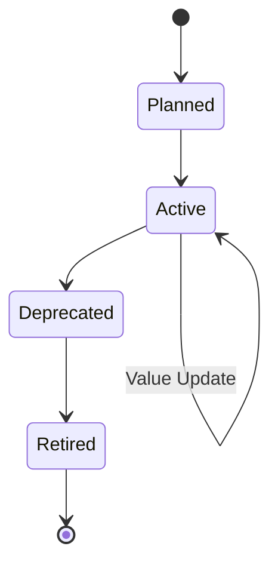
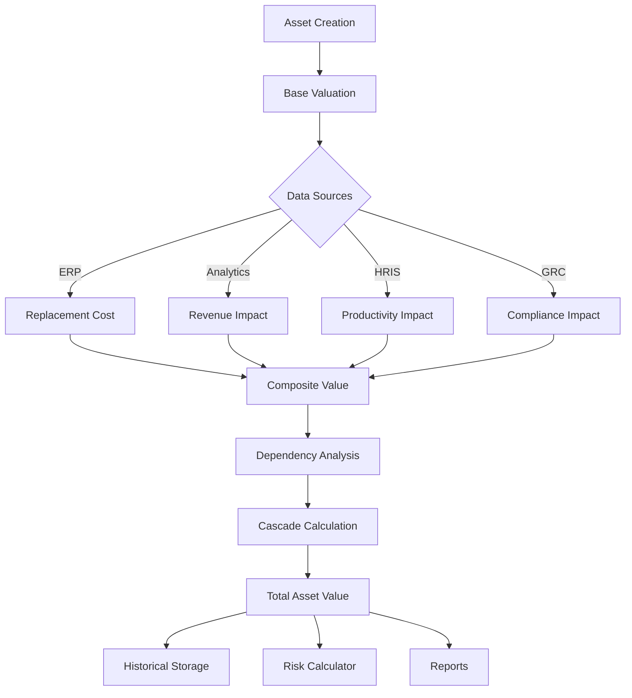
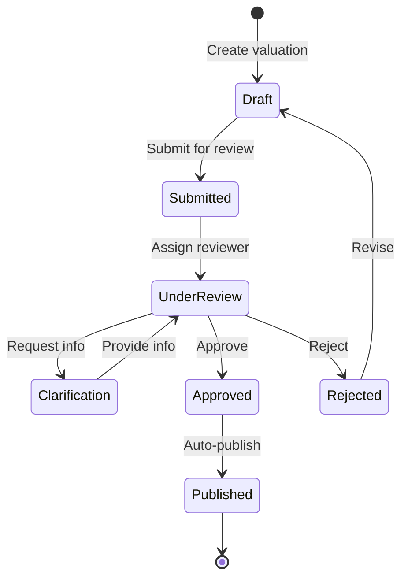

# Product Requirements Document
## Asset Valuation System

**Version:** 1.0  
**Date:** June 2025  
**Status:** Draft  
**Product Owner:** Risk Analytics Team  
**Technical Lead:** Financial Engineering

---

## Table of Contents

1. [Executive Summary](#1-executive-summary)
2. [Business Context](#2-business-context)
3. [User Research & Personas](#3-user-research--personas)
4. [Valuation Framework](#4-valuation-framework)
5. [Functional Requirements](#5-functional-requirements)
6. [Technical Architecture](#6-technical-architecture)
7. [Data Requirements](#7-data-requirements)
8. [Integration Requirements](#8-integration-requirements)
9. [User Interface Design](#9-user-interface-design)
10. [Calculation Methodologies](#10-calculation-methodologies)
11. [Industry-Specific Models](#11-industry-specific-models)
12. [Validation & Governance](#12-validation--governance)
13. [Performance Requirements](#13-performance-requirements)
14. [Success Metrics](#14-success-metrics)
15. [Implementation Plan](#15-implementation-plan)
16. [Appendices](#16-appendices)

---

## 1. Executive Summary

### 1.1 Purpose
The Asset Valuation System is a critical component of the Risk Exposure & Prioritization Calculator that transforms abstract IT assets into quantified business values. This enables accurate financial risk calculations and defensible prioritization of security investments based on true business impact.

### 1.2 Problem Statement
Current challenges in asset valuation:
- **Incomplete Picture**: IT teams know technical details but not business value
- **Subjective Ratings**: "Critical/High/Medium/Low" labels lack financial precision
- **Hidden Dependencies**: Cascading impacts not captured
- **Static Values**: No adjustment for market changes or depreciation
- **Compliance Blind Spots**: Regulatory penalties not factored into asset worth

### 1.3 Solution Overview
A comprehensive asset valuation platform that:
- Automates value discovery from multiple sources
- Provides multiple valuation methods for complete assessment
- Tracks dependencies for cascade impact analysis  
- Maintains historical values with trending
- Integrates industry-specific valuation models
- Offers defensible, auditable valuation processes

### 1.4 Key Benefits
- **Accurate Risk Quantification**: Risk = Probability × Impact (properly calculated)
- **Better Prioritization**: Focus on assets that truly matter to the business
- **Board Communication**: Speak in financial terms executives understand
- **Regulatory Compliance**: Demonstrate due diligence in asset management
- **Insurance Optimization**: Accurate values for cyber insurance coverage

---

## 2. Business Context

### 2.1 Market Drivers

#### 2.1.1 Regulatory Requirements
- **SEC Materiality Rules**: Need to define "material" cyber incidents in financial terms
- **SOX Compliance**: Financial controls require accurate IT asset valuation
- **Insurance Requirements**: Cyber policies demand detailed asset inventories
- **M&A Due Diligence**: Accurate technology asset valuation for transactions

#### 2.1.2 Business Trends
- **Digital Transformation**: 70% of business value now in digital assets
- **Intangible Assets**: Data and IP often worth more than physical assets
- **Dynamic Markets**: Asset values fluctuate with business conditions
- **Ecosystem Dependencies**: Third-party connections multiply risk exposure

### 2.2 Current State Analysis

#### 2.2.1 Common Approaches
| Method | Usage | Limitations |
|--------|--------|-------------|
| Criticality Labels | 90% | No financial basis |
| Replacement Cost Only | 60% | Ignores business impact |
| Manual Estimates | 80% | Inconsistent, time-consuming |
| No Valuation | 30% | Flying blind on risk |

#### 2.2.2 Pain Points by Role
- **CSOs**: Can't justify budget without financial impact data
- **Risk Managers**: Struggle to prioritize without comparable values
- **CFOs**: Don't trust IT's subjective asset ratings
- **Auditors**: Find inadequate documentation for asset values

### 2.3 Competitive Landscape

| Vendor | Valuation Capability | Limitations |
|--------|---------------------|-------------|
| ServiceNow | Basic CI costing | No business impact |
| Archer | Manual entry | Limited automation |
| MetricStream | Compliance focus | Not financial |
| Excel/Manual | Fully custom | Not scalable |

**Market Gap**: No solution provides automated, multi-dimensional business valuation with dependency analysis and industry-specific models.

---

## 3. User Research & Personas

### 3.1 Research Findings

#### 3.1.1 Key Insights
- **Time Constraint**: Users spend <5 minutes per asset on valuation
- **Data Availability**: 40% of needed data exists but is scattered
- **Confidence Crisis**: 75% doubt their current valuations
- **Audit Failures**: 50% failed to justify values to auditors

#### 3.1.2 User Quotes
> "I know our CRM is critical, but I can't put a dollar value on it" - IT Director

> "The replacement cost of a server is $50K, but the business impact of losing it could be millions" - Risk Manager

> "Every audit, we scramble to justify our asset values" - Compliance Officer

### 3.2 Primary Personas

#### Persona 1: Asset Owner "Alexandra"
**Role**: Business Line Manager  
**Responsibility**: P&L for $500M division

**Goals**:
- Understand financial exposure from IT dependencies
- Justify IT investment requests
- Meet compliance requirements

**Pain Points**:
- No visibility into IT asset values
- Can't quantify downtime impact
- Disputes IT's criticality ratings

**Success Criteria**:
- Assets valued in business terms
- Clear dependency visibility
- Audit-ready documentation

#### Persona 2: Risk Analyst "Ryan"
**Role**: Senior Risk Analyst  
**Responsibility**: Maintain risk register for 1000+ assets

**Goals**:
- Automate repetitive valuation tasks
- Ensure consistent methodology
- Track value changes over time

**Pain Points**:
- Manual data gathering from 10+ systems
- Inconsistent valuation approaches
- No historical trending

**Success Criteria**:
- 80% automated data collection
- Standardized calculations
- Complete audit trail

#### Persona 3: Financial Controller "Fatima"
**Role**: VP Finance  
**Responsibility**: Technology asset accounting

**Goals**:
- Accurate asset register for financial reporting
- Depreciation tracking
- Insurance valuation support

**Pain Points**:
- IT assets not in financial systems
- No link between tech and financial data
- Insurance disputes on values

**Success Criteria**:
- Integration with ERP
- Automated depreciation
- Insurance-ready reports

### 3.3 User Journey: Quarterly Asset Review

**Current State** (2 weeks):
1. Email request for asset updates (Day 1)
2. Manual data gathering (Days 2-5)
3. Spreadsheet consolidation (Days 6-7)
4. Review meetings (Days 8-9)
5. Dispute resolution (Days 10-12)
6. Final report (Days 13-14)

**Future State** (2 days):
1. Automated data refresh (2 hours)
2. Exception review (4 hours)
3. Stakeholder validation (1 day)
4. Approved report (2 hours)

---

## 4. Valuation Framework

### 4.1 Core Valuation Dimensions

#### 4.1.1 Replacement Cost
**Definition**: Direct cost to replace/rebuild the asset

**Components**:
- Hardware costs
- Software licensing
- Implementation services
- Migration costs
- Training expenses

**When to Use**: 
- Infrastructure assets
- Standard software
- Commodity systems

#### 4.1.2 Revenue Impact
**Definition**: Lost revenue during asset unavailability

**Components**:
- Direct revenue loss
- Transaction volume impact
- Customer acquisition delays
- Upsell/cross-sell impact
- Market share erosion

**When to Use**:
- Revenue-generating systems
- Customer-facing applications
- E-commerce platforms

#### 4.1.3 Productivity Impact
**Definition**: Cost of reduced employee productivity

**Components**:
- Affected user count
- Hourly productivity loss
- Workaround inefficiency
- Decision delays
- Quality degradation

**When to Use**:
- Internal tools
- Collaboration systems
- Development environments

#### 4.1.4 Compliance Impact
**Definition**: Regulatory penalties and remediation costs

**Components**:
- Statutory fines
- Litigation costs
- Remediation expenses
- Audit costs
- License revocation risk

**When to Use**:
- Regulated data
- Compliance systems
- Audit trails

#### 4.1.5 Reputational Impact
**Definition**: Brand damage and customer trust loss

**Components**:
- Customer churn
- New customer acquisition cost increase
- Partner relationship damage
- Stock price impact
- Crisis management costs

**When to Use**:
- Customer data
- Public-facing systems
- Brand-critical assets

### 4.2 Composite Valuation Model

```
Total Asset Value (TAV) = RC + (RI × RD) + (PI × PD) + CI + RepI

Where:
- RC = Replacement Cost
- RI = Revenue Impact per hour
- RD = Revenue Duration (hours)
- PI = Productivity Impact per hour
- PD = Productivity Duration (hours)
- CI = Compliance Impact
- RepI = Reputational Impact
```

### 4.3 Confidence Scoring

Each valuation component includes confidence scoring:

| Confidence Level | Score | Criteria |
|-----------------|-------|----------|
| High | 90-100% | Hard data from systems |
| Medium | 70-89% | Estimates with benchmarks |
| Low | 50-69% | Expert judgment only |
| Unknown | <50% | Insufficient data |

### 4.4 Dependency Multipliers

**Cascade Impact Formula**:
```
Cascade Value = Σ(Dependent Asset Value × Dependency Factor)

Dependency Factors:
- Critical (Single Point of Failure): 1.0
- High (Major Degradation): 0.7
- Medium (Partial Impact): 0.4
- Low (Minor Impact): 0.1
```

---

## 5. Functional Requirements

### 5.1 Asset Inventory Management

#### 5.1.1 Asset Definition
**Priority**: P0 (Critical)

**FR-AV-001**: System shall support comprehensive asset profiles

**Acceptance Criteria**:
- Asset types: Application, Database, Infrastructure, Data, Service, Process
- Standard fields:
  - Unique identifier
  - Name and description
  - Business owner
  - Technical owner
  - Location (physical/cloud)
  - Lifecycle stage
  - Last updated
- Custom fields: Up to 50 per organization
- Relationship types: Depends on, Supports, Integrates with, Backs up

**FR-AV-002**: System shall maintain asset lifecycle states

**States**:


#### 5.1.2 Bulk Operations
**Priority**: P0 (Critical)

**FR-AV-003**: System shall support bulk asset operations

**Acceptance Criteria**:
- CSV/Excel import with mapping
- Bulk update via filtered selection
- Mass valuation recalculation
- Bulk depreciation application
- Export with all valuation data

### 5.2 Valuation Methods

#### 5.2.1 Replacement Cost Calculator
**Priority**: P0 (Critical)

**FR-VM-001**: System shall calculate comprehensive replacement costs

**Components**:
```yaml
Hardware:
  - Purchase price
  - Shipping/handling
  - Installation labor
  - Rack space cost
  
Software:
  - License fees
  - Maintenance contracts
  - Version upgrade rights
  - User CALs
  
Services:
  - Implementation consulting
  - Data migration
  - Training delivery
  - Project management
  
Opportunity:
  - Business disruption
  - Parallel running costs
  - Accelerated depreciation
```

**FR-VM-002**: System shall support multiple cost scenarios

**Scenarios**:
- Emergency replacement (rush charges)
- Planned replacement (normal costs)
- Upgrade replacement (enhanced capabilities)
- Cloud migration (OpEx model)

#### 5.2.2 Revenue Impact Calculator
**Priority**: P0 (Critical)

**FR-VM-003**: System shall calculate revenue loss scenarios

**Input Methods**:
1. **Direct Transaction**: 
   - Transactions per hour
   - Average transaction value
   - Peak vs. normal periods

2. **Percentage-Based**:
   - % of total revenue affected
   - Annual revenue allocation
   - Seasonality factors

3. **Customer-Based**:
   - Affected customer count
   - Customer lifetime value
   - Churn probability

**FR-VM-004**: System shall model recovery curves

**Recovery Models**:
- Immediate (0% → 100%)
- Linear (gradual recovery)
- Stepped (phased recovery)
- Delayed (backlog impact)

#### 5.2.3 Productivity Impact Calculator
**Priority**: P0 (Critical)

**FR-VM-005**: System shall quantify workforce productivity loss

**Calculation Framework**:
```
Productivity Loss = Σ(Users × Hourly_Rate × Impact_%) × Duration

Where Impact% varies by scenario:
- Complete outage: 100%
- Degraded performance: 50%
- Feature limitation: 25%
- Minor inconvenience: 10%
```

**FR-VM-006**: System shall support role-based impact

**Role Considerations**:
- Executive impact multiplier (decision delays)
- Revenue-generating roles priority
- Customer-facing penalty
- Contractor vs. employee costs

#### 5.2.4 Compliance Impact Calculator
**Priority**: P1 (High)

**FR-VM-007**: System shall calculate regulatory exposure

**Regulation Library**:
| Regulation | Fine Structure | Calculation Method |
|------------|---------------|-------------------|
| GDPR | Up to 4% revenue or €20M | Records × breach probability |
| HIPAA | $50K - $1.5M per violation | Covered entities × severity |
| PCI-DSS | $5K - $100K monthly | Transaction volume based |
| SOX | $1M - $5M + criminal | Control failure severity |
| CCPA | $7,500 per intentional | California residents affected |

**FR-VM-008**: System shall track compliance dependencies

**Compliance Mapping**:
- Asset → Regulation requirements
- Control effectiveness scoring
- Audit finding history
- Remediation cost tracking

#### 5.2.5 Reputational Impact Calculator
**Priority**: P1 (High)

**FR-VM-009**: System shall model brand damage costs

**Quantification Methods**:
1. **Customer Metrics**:
   - Churn rate increase
   - Acquisition cost increase
   - Satisfaction score decrease

2. **Market Metrics**:
   - Stock price impact (public companies)
   - Market share loss
   - Competitive disadvantage period

3. **Response Costs**:
   - Crisis PR campaigns
   - Customer remediation
   - Executive time allocation

### 5.3 Dependency Management

#### 5.3.1 Dependency Mapping
**Priority**: P0 (Critical)

**FR-DM-001**: System shall model asset interdependencies

**Visualization Requirements**:
- Interactive network diagram
- Hierarchical tree view
- Impact path highlighting
- Circular dependency detection
- Criticality heat mapping

**FR-DM-002**: System shall calculate cascade impacts

**Cascade Rules**:
```python
def calculate_cascade_impact(asset, visited=None):
    if visited is None:
        visited = set()
    
    if asset.id in visited:
        return 0  # Prevent circular calculation
    
    visited.add(asset.id)
    direct_value = asset.total_value
    
    cascade_value = 0
    for dep in asset.dependencies:
        dep_impact = calculate_cascade_impact(dep.asset, visited)
        cascade_value += dep_impact * dep.impact_factor
    
    return direct_value + cascade_value
```

#### 5.3.2 Single Points of Failure
**Priority**: P1 (High)

**FR-DM-003**: System shall identify critical dependencies

**SPOF Detection**:
- Assets with no redundancy
- Critical path analysis
- Business impact if removed
- Remediation recommendations

### 5.4 Historical Tracking

#### 5.4.1 Value Trending
**Priority**: P1 (High)

**FR-HT-001**: System shall track valuation history

**Time Series Data**:
- Daily snapshots for critical assets
- Weekly for important assets
- Monthly for standard assets
- Event-driven captures
- Unlimited retention

**FR-HT-002**: System shall analyze value trends

**Analytics**:
- Growth/decline rates
- Volatility metrics
- Seasonal patterns
- Correlation analysis
- Predictive trending

#### 5.4.2 Depreciation Modeling
**Priority**: P1 (High)

**FR-HT-003**: System shall calculate depreciation

**Depreciation Methods**:
1. **Straight Line**: Even reduction over lifespan
2. **Accelerated**: Front-loaded depreciation
3. **Usage-Based**: Tied to utilization metrics
4. **Market-Based**: External benchmark adjustment
5. **Custom Curves**: User-defined depreciation

### 5.5 Automation Features

#### 5.5.1 Data Collection
**Priority**: P0 (Critical)

**FR-AF-001**: System shall automate value inputs

**Automation Sources**:
| Data Type | Source Systems | Update Frequency |
|-----------|---------------|------------------|
| Purchase Costs | ERP, Procurement | Daily |
| User Counts | AD, LDAP, IAM | Hourly |
| Transaction Volume | Apps, Databases | Real-time |
| Revenue Data | Financial Systems | Daily |
| Compliance Findings | GRC Platforms | Weekly |

**FR-AF-002**: System shall detect value anomalies

**Anomaly Detection**:
- Sudden value changes (>25%)
- Missing data patterns
- Inconsistent sources
- Stale data warnings
- Validation rule breaches

#### 5.5.2 Intelligent Recommendations
**Priority**: P2 (Medium)

**FR-AF-003**: System shall provide ML-based suggestions

**ML Features**:
- Similar asset comparison
- Industry benchmarking
- Confidence improvement tips
- Missing data predictions
- Optimization opportunities

---

## 6. Technical Architecture

### 6.1 Service Architecture

```
┌─────────────────────────────────────────────────────────────┐
│                   Asset Valuation Service                    │
├─────────────────────────────────────────────────────────────┤
│  ┌─────────────┐  ┌──────────────┐  ┌───────────────┐     │
│  │Valuation    │  │Dependency    │  │Integration    │     │
│  │Engine       │  │Analyzer      │  │Gateway        │     │
│  └──────┬──────┘  └──────┬───────┘  └───────┬───────┘     │
│         │                │                   │              │
│  ┌──────▼────────────────▼─────────────────▼───────┐      │
│  │           Message Queue (Kafka/RabbitMQ)         │      │
│  └──────────────────────┬───────────────────────────┘      │
│                         │                                   │
│  ┌──────────────────────▼───────────────────────────┐      │
│  │              Calculation Workers                  │      │
│  │  ┌─────────┐ ┌──────────┐ ┌───────────────┐    │      │
│  │  │Revenue  │ │Compliance│ │Reputation     │    │      │
│  │  │Calculator│ │Calculator│ │Calculator     │    │      │
│  │  └─────────┘ └──────────┘ └───────────────┘    │      │
│  └──────────────────────────────────────────────────┘      │
└─────────────────────────────────────────────────────────────┘
```

### 6.2 Data Flow Architecture



### 6.3 Technology Stack

#### 6.3.1 Core Services
- **Language**: Python 3.11+ for calculation engine
- **Framework**: FastAPI for REST APIs
- **Database**: PostgreSQL with TimescaleDB extension
- **Cache**: Redis for calculation results
- **Queue**: Apache Kafka for event streaming

#### 6.3.2 Calculation Libraries
- **Financial**: QuantLib for complex financial calculations
- **Statistics**: SciPy/NumPy for statistical analysis
- **ML**: Scikit-learn for predictions
- **Graph**: NetworkX for dependency analysis

### 6.4 API Design

#### 6.4.1 RESTful Endpoints

**Asset Valuation APIs**:
```yaml
# Create/Update Valuation
POST /api/v1/assets/{asset_id}/valuations
{
  "valuation_date": "2025-06-19",
  "components": {
    "replacement_cost": {
      "value": 500000,
      "confidence": 0.95,
      "source": "ERP_SYNC",
      "details": {...}
    },
    "revenue_impact": {
      "value": 10000000,
      "confidence": 0.85,
      "calculation_method": "transaction_based",
      "parameters": {...}
    }
  }
}

# Get Current Valuation
GET /api/v1/assets/{asset_id}/valuations/current

# Get Historical Valuations
GET /api/v1/assets/{asset_id}/valuations/history?start=2024-01-01&end=2025-01-01

# Bulk Recalculation
POST /api/v1/valuations/recalculate
{
  "asset_ids": ["uuid1", "uuid2"],
  "valuation_date": "2025-06-19",
  "components": ["revenue_impact", "compliance_impact"]
}
```

#### 6.4.2 GraphQL Schema

```graphql
type Asset {
  id: ID!
  name: String!
  currentValuation: Valuation
  valuationHistory(
    startDate: Date
    endDate: Date
    limit: Int
  ): [Valuation!]!
  dependencies: [Dependency!]!
  cascadeImpact: CascadeImpact
}

type Valuation {
  id: ID!
  date: Date!
  totalValue: Float!
  confidence: Float!
  components: [ValuationComponent!]!
  approvalStatus: ApprovalStatus
}

type ValuationComponent {
  type: ComponentType!
  value: Float!
  confidence: Float!
  source: DataSource!
  lastUpdated: DateTime!
  breakdown: JSON
}

enum ComponentType {
  REPLACEMENT_COST
  REVENUE_IMPACT
  PRODUCTIVITY_IMPACT
  COMPLIANCE_IMPACT
  REPUTATIONAL_IMPACT
}
```

---

## 7. Data Requirements

### 7.1 Core Data Model

#### 7.1.1 Asset Valuation Tables

```sql
-- Main valuation record
CREATE TABLE asset_valuations (
    id UUID PRIMARY KEY DEFAULT gen_random_uuid(),
    asset_id UUID NOT NULL REFERENCES assets(id),
    valuation_date DATE NOT NULL,
    total_value DECIMAL(15,2) NOT NULL,
    currency VARCHAR(3) DEFAULT 'USD',
    confidence_score DECIMAL(3,2),
    status VARCHAR(20) DEFAULT 'DRAFT',
    approved_by UUID REFERENCES users(id),
    approved_at TIMESTAMP,
    created_at TIMESTAMP DEFAULT NOW(),
    updated_at TIMESTAMP DEFAULT NOW(),
    UNIQUE(asset_id, valuation_date)
);

-- Component breakdown
CREATE TABLE valuation_components (
    id UUID PRIMARY KEY DEFAULT gen_random_uuid(),
    valuation_id UUID REFERENCES asset_valuations(id),
    component_type VARCHAR(50) NOT NULL,
    value DECIMAL(15,2) NOT NULL,
    confidence DECIMAL(3,2),
    data_source VARCHAR(100),
    calculation_method VARCHAR(100),
    parameters JSONB,
    evidence JSONB,
    created_at TIMESTAMP DEFAULT NOW()
);

-- Historical time series
CREATE TABLE valuation_history (
    time TIMESTAMPTZ NOT NULL,
    asset_id UUID NOT NULL,
    component_type VARCHAR(50),
    value DECIMAL(15,2),
    confidence DECIMAL(3,2),
    PRIMARY KEY (time, asset_id, component_type)
);

-- Create hypertable for time series data
SELECT create_hypertable('valuation_history', 'time');

-- Dependencies for cascade calculations
CREATE TABLE asset_dependencies (
    id UUID PRIMARY KEY DEFAULT gen_random_uuid(),
    parent_asset_id UUID REFERENCES assets(id),
    dependent_asset_id UUID REFERENCES assets(id),
    dependency_type VARCHAR(50),
    impact_factor DECIMAL(3,2) CHECK (impact_factor BETWEEN 0 AND 1),
    description TEXT,
    created_at TIMESTAMP DEFAULT NOW(),
    UNIQUE(parent_asset_id, dependent_asset_id)
);
```

#### 7.1.2 Reference Data

```sql
-- Industry benchmarks
CREATE TABLE industry_benchmarks (
    id UUID PRIMARY KEY DEFAULT gen_random_uuid(),
    industry VARCHAR(100),
    asset_type VARCHAR(50),
    metric_name VARCHAR(100),
    metric_value DECIMAL(15,2),
    percentile INTEGER,
    source VARCHAR(200),
    effective_date DATE,
    region VARCHAR(50)
);

-- Depreciation schedules  
CREATE TABLE depreciation_schedules (
    id UUID PRIMARY KEY DEFAULT gen_random_uuid(),
    name VARCHAR(100),
    asset_type VARCHAR(50),
    method VARCHAR(50), -- straight_line, accelerated, custom
    useful_life_years INTEGER,
    salvage_percentage DECIMAL(5,2),
    custom_curve JSONB
);

-- Compliance fine schedules
CREATE TABLE compliance_fines (
    id UUID PRIMARY KEY DEFAULT gen_random_uuid(),
    regulation VARCHAR(100),
    violation_type VARCHAR(200),
    fine_structure JSONB, -- {min, max, percentage, per_record}
    effective_date DATE,
    jurisdiction VARCHAR(100)
);
```

### 7.2 Data Sources

#### 7.2.1 Internal Data Sources

| Source System | Data Elements | Integration Method | Frequency |
|--------------|---------------|-------------------|-----------|
| ERP (SAP/Oracle) | Purchase orders, Asset costs | REST API | Real-time |
| CMDB | Asset inventory, Relationships | GraphQL | Hourly |
| APM Tools | Transaction volumes, User counts | Streaming | Real-time |
| Financial Systems | Revenue allocation, Cost centers | Batch ETL | Daily |
| HR Systems | Employee costs, Departments | REST API | Daily |
| GRC Platforms | Compliance findings, Controls | Webhook | Event-driven |

#### 7.2.2 External Data Sources

| Source | Data Elements | Integration Method | Frequency |
|--------|---------------|-------------------|-----------|
| Market Data Providers | Technology costs, Depreciation rates | API | Weekly |
| Regulatory Databases | Fine schedules, Compliance updates | Web scraping | Monthly |
| Industry Reports | Benchmarks, Best practices | Manual upload | Quarterly |
| Threat Intelligence | Breach costs, Impact data | API | Daily |

### 7.3 Data Quality Rules

#### 7.3.1 Validation Rules

```yaml
Asset Valuation Rules:
  - rule: "Total value must be positive"
    condition: total_value > 0
    severity: ERROR
    
  - rule: "Confidence between 0 and 1"
    condition: confidence_score BETWEEN 0 AND 1
    severity: ERROR
    
  - rule: "At least one component required"
    condition: COUNT(components) >= 1
    severity: ERROR
    
  - rule: "Component values sum to total"
    condition: SUM(component_values) = total_value
    severity: WARNING
    tolerance: 0.01
    
  - rule: "Recent valuation exists"
    condition: DATEDIFF(last_valuation, today) <= 90
    severity: WARNING
    
  - rule: "Dependency cycles prohibited"
    condition: NO_CIRCULAR_DEPENDENCIES()
    severity: ERROR
```

#### 7.3.2 Data Completeness Scoring

```python
def calculate_completeness_score(asset_valuation):
    weights = {
        'replacement_cost': 0.2,
        'revenue_impact': 0.3,
        'productivity_impact': 0.2,
        'compliance_impact': 0.15,
        'reputational_impact': 0.15
    }
    
    score = 0
    for component, weight in weights.items():
        if component in asset_valuation.components:
            confidence = asset_valuation.components[component].confidence
            score += weight * confidence
    
    return score
```

---

## 8. Integration Requirements

### 8.1 ERP Integration

#### 8.1.1 SAP Integration
**Purpose**: Synchronize financial data for replacement costs

**Integration Pattern**: Real-time API with batch reconciliation

**SAP Functions**:
```abap
" Get Asset Master Data
FUNCTION Z_GET_ASSET_MASTER.
  IMPORTING
    IV_ASSET_NUMBER TYPE ANLN1
  EXPORTING
    ES_ASSET_DATA TYPE ZASSET_MASTER
    ET_COSTS TYPE TABLE OF ZASSET_COSTS
    EV_RETURN TYPE BAPIRET2.

" Get Depreciation Data
FUNCTION Z_GET_ASSET_DEPRECIATION.
  IMPORTING
    IV_ASSET_NUMBER TYPE ANLN1
    IV_FISCAL_YEAR TYPE GJAHR
  EXPORTING
    ET_DEPRECIATION TYPE TABLE OF ZDEPRECIATION
    EV_BOOK_VALUE TYPE ANLC-ANSWL.
```

**Field Mapping**:
| SAP Field | System Field | Transformation |
|-----------|--------------|----------------|
| ANLN1 | asset.external_id | Direct |
| TXT50 | asset.name | Direct |
| AKTIV | asset.activation_date | Date format |
| ANSWL | valuation.replacement_cost | Currency conversion |
| NAFAP | valuation.depreciation | Calculate current |

#### 8.1.2 Oracle ERP Integration
**Purpose**: Alternative ERP for asset financial data

**REST API Endpoints**:
```yaml
# Asset Details
GET /fscmRestApi/resources/11.13.18.05/assets/{AssetId}

# Asset Costs
GET /fscmRestApi/resources/11.13.18.05/assetCosts?q=AssetId={AssetId}

# Depreciation
GET /fscmRestApi/resources/11.13.18.05/assetDepreciation?q=AssetId={AssetId}
```

### 8.2 Business Intelligence Integration

#### 8.2.1 Revenue Data Sources
**Purpose**: Calculate revenue impact valuations

**Tableau Integration**:
```python
class TableauConnector:
    def __init__(self, server_url, site_id):
        self.server = TSC.Server(server_url)
        self.site_id = site_id
    
    def get_revenue_metrics(self, asset_id, date_range):
        # Query revenue attribution view
        view_id = "revenue-by-system"
        filters = [
            f"asset_id={asset_id}",
            f"date>={date_range.start}",
            f"date<={date_range.end}"
        ]
        
        return self.server.views.get_data(
            view_id=view_id,
            filters=filters
        )
```

**Power BI Integration**:
```javascript
// Power BI REST API call
const getRevenueData = async (assetId, dateRange) => {
  const datasetId = 'revenue-attribution-dataset';
  const query = {
    "queries": [{
      "query": `EVALUATE FILTER(RevenueTable, 
                RevenueTable[AssetId] = "${assetId}" &&
                RevenueTable[Date] >= DATE(${dateRange.start}) &&
                RevenueTable[Date] <= DATE(${dateRange.end}))`
    }]
  };
  
  return await powerBI.datasets.executeQueries(datasetId, query);
};
```

### 8.3 ITSM Integration

#### 8.3.1 ServiceNow CMDB
**Purpose**: Asset inventory and relationship data

**Table Access Required**:
- cmdb_ci (Configuration Items)
- cmdb_rel_ci (CI Relationships)
- cmdb_ci_service (Business Services)
- cmdb_ci_appl (Applications)

**Dependency Sync**:
```javascript
// ServiceNow Script Include
var AssetDependencySync = Class.create();
AssetDependencySync.prototype = {
    initialize: function() {
        this.relationshipTypes = [
            'Depends on::Used by',
            'Runs on::Runs',
            'Virtualized by::Virtualizes'
        ];
    },
    
    getDependencies: function(ci_sys_id) {
        var deps = [];
        var relGR = new GlideRecord('cmdb_rel_ci');
        relGR.addQuery('parent', ci_sys_id);
        relGR.addQuery('type', 'IN', this.relationshipTypes);
        relGR.query();
        
        while (relGR.next()) {
            deps.push({
                parent_id: relGR.parent.sys_id.toString(),
                child_id: relGR.child.sys_id.toString(),
                type: relGR.type.toString(),
                impact: this.calculateImpact(relGR.type)
            });
        }
        return deps;
    }
};
```

### 8.4 Monitoring Integration

#### 8.4.1 APM Tools (Datadog/New Relic)
**Purpose**: Real-time transaction and user metrics

**Datadog Metrics API**:
```python
def get_transaction_metrics(asset_identifier, time_range):
    query = f"""
    avg:transaction.count{{
        service:{asset_identifier}
    }}.rollup(sum, 3600)
    """
    
    metrics = datadog_api.Metric.query(
        start=time_range.start,
        end=time_range.end,
        query=query
    )
    
    return calculate_revenue_impact(metrics)
```

**New Relic NRQL**:
```sql
-- Get transaction volume for revenue calculation
SELECT 
  count(*) as transaction_count,
  average(duration) as avg_duration,
  uniqueCount(userId) as unique_users
FROM Transaction
WHERE appName = '{asset_name}'
SINCE 1 day ago
FACET hourOf(timestamp)
```

---

## 9. User Interface Design

### 9.1 Design Principles

#### 9.1.1 Information Architecture
- **Progressive Disclosure**: Show summary, reveal detail on demand
- **Context Preservation**: Maintain state during navigation
- **Bulk Operations**: Enable efficient updates
- **Visual Hierarchy**: Financial values prominent
- **Confidence Indicators**: Always visible

#### 9.1.2 Visual Language
- **Color Coding**:
  - Green: High confidence (>85%)
  - Yellow: Medium confidence (70-85%)
  - Orange: Low confidence (<70%)
  - Red: Missing/invalid data
- **Icons**: Industry-standard financial symbols
- **Charts**: Consistent D3.js visualizations

### 9.2 Key Screens

#### 9.2.1 Asset Valuation Dashboard
```
┌─────────────────────────────────────────────────────────────┐
│ Asset Valuation Dashboard              [Search] [+ New Asset]│
├─────────────────────────────────────────────────────────────┤
│ ┌─────────────┐ ┌─────────────┐ ┌─────────────┐ ┌─────────┐│
│ │Total Value  │ │Avg Confidence│ │Assets Valued│ │Overdue  ││
│ │  $847.3M    │ │    82.4%     │ │   1,247     │ │   127   ││
│ │  ↑ 12.3%    │ │    ↑ 5.2%    │ │  ↑ 8.1%     │ │ ↓ 15.3% ││
│ └─────────────┘ └─────────────┘ └─────────────┘ └─────────┘│
├─────────────────────────────────────────────────────────────┤
│ Value Distribution            Top 10 Assets by Value         │
│ ┌──────────────────┐         ┌─────────────────────────────┐│
│ │   [Pie Chart]    │         │1. Customer Database  $45.2M ││
│ │                  │         │2. E-Commerce Platform $38.7M││
│ │                  │         │3. Core Banking System $31.5M││
│ └──────────────────┘         └─────────────────────────────┘│
├─────────────────────────────────────────────────────────────┤
│ Asset Inventory                                    [Filters▼]│
│ ┌─────────────────────────────────────────────────────────┐│
│ │□ Asset Name    │ Value     │Confidence│ Updated  │Action││
│ │□ CRM System    │ $12.5M    │ 95%      │ Today    │ [→]  ││
│ │□ HR Portal     │ $8.3M     │ 72%      │ 3d ago   │ [→]  ││
│ │□ File Server   │ $2.1M     │ 68% ⚠    │ 15d ago  │ [→]  ││
│ └─────────────────────────────────────────────────────────┘│
└─────────────────────────────────────────────────────────────┘
```

#### 9.2.2 Asset Valuation Detail
```
┌─────────────────────────────────────────────────────────────┐
│ Customer Database (PROD-CRM-001)        [Edit] [Recalculate]│
├─────────────────────────────────────────────────────────────┤
│ Current Valuation: $45.2M (95% confidence)    Updated: Today│
├─────────────────────────────────────────────────────────────┤
│ Valuation Components                          [Add Component]│
│ ┌─────────────────────────────────────────────────────────┐│
│ │ Replacement Cost               $2.1M  [98%] █████████░  ││
│ │   - Hardware: $500K                                      ││
│ │   - Software: $1.2M                                      ││
│ │   - Implementation: $400K                                ││
│ │                                                           ││
│ │ Revenue Impact                $38.5M  [94%] █████████░  ││
│ │   - Direct sales: $25M/year                              ││
│ │   - Cross-sell impact: $13.5M/year                       ││
│ │   - Recovery time: 48 hours                              ││
│ │                                                           ││
│ │ Productivity Impact            $1.8M  [88%] ████████░░  ││
│ │   - Affected users: 450                                  ││
│ │   - Productivity loss: 85%                               ││
│ │   - Duration: 48 hours                                   ││
│ │                                                           ││
│ │ Compliance Impact              $2.3M  [92%] █████████░  ││
│ │   - GDPR exposure: $1.5M                                 ││
│ │   - CCPA exposure: $800K                                 ││
│ │                                                           ││
│ │ Reputational Impact            $500K  [75%] ███████░░░  ││
│ │   - Customer churn: 2%                                   ││
│ │   - PR response: $200K                                   ││
│ └─────────────────────────────────────────────────────────┘│
├─────────────────────────────────────────────────────────────┤
│ Dependencies & Cascade Impact                    [View Graph]│
│ ┌─────────────────────────────────────────────────────────┐│
│ │ This asset impacts:                                      ││
│ │ → Web Portal ($8.5M cascade)                             ││
│ │ → Mobile App ($6.2M cascade)                             ││
│ │ → Analytics Platform ($3.1M cascade)                     ││
│ │                                                           ││
│ │ Total Cascade Impact: $17.8M                             ││
│ └─────────────────────────────────────────────────────────┘│
└─────────────────────────────────────────────────────────────┘
```

#### 9.2.3 Valuation Workflow
```
┌─────────────────────────────────────────────────────────────┐
│ Asset Valuation Wizard                    Step 2 of 5 [Next>]│
├─────────────────────────────────────────────────────────────┤
│ Revenue Impact Calculation                                   │
│                                                              │
│ How does this asset generate or enable revenue?             │
│                                                              │
│ ○ Direct Revenue Generation                                  │
│   Transaction Volume: [_________] per hour                   │
│   Average Transaction: $[_______]                            │
│                                                              │
│ ● Revenue Enablement                                         │
│   Annual Revenue Supported: $[25,000,000]                    │
│   % Impact if Unavailable: [___85___]%                       │
│                                                              │
│ ○ Not Revenue Impacting                                      │
│                                                              │
│ Recovery Time Estimate:                                      │
│ [0]──────●─────────[24]───────────[48]──────────[72] hours  │
│         12 hours                                             │
│                                                              │
│ Data Source: [Analytics Platform ▼] Confidence: [High ▼]    │
│                                                              │
│ 💡 Tip: Check last month's transaction reports for accurate  │
│        volume data.                                          │
└─────────────────────────────────────────────────────────────┘
```

### 9.3 Mobile Experience

#### 9.3.1 Responsive Breakpoints
- **Desktop**: 1920px (full dashboard)
- **Laptop**: 1366px (condensed dashboard)
- **Tablet**: 768px (stacked layout)
- **Phone**: 375px (read-only summary)

#### 9.3.2 Tablet-Optimized Views
- Executive summary dashboard
- Asset quick valuation
- Approval workflows
- Read-only reports

### 9.4 Interaction Patterns

#### 9.4.1 Bulk Operations
```
Selected: 15 assets                      [Select All] [Clear]
─────────────────────────────────────────────────────────────
Bulk Actions: [Recalculate] [Update Values] [Export] [Delete]

With selected assets:
□ Apply 10% annual appreciation
□ Update confidence scores based on age
□ Trigger compliance review
□ Generate valuation report
```

#### 9.4.2 Quick Actions
- **Hover States**: Show key metrics
- **Right-Click Menu**: Common operations
- **Keyboard Shortcuts**: 
  - Ctrl+R: Recalculate
  - Ctrl+E: Edit
  - Ctrl+D: Duplicate
- **Drag & Drop**: Reorder, assign

---

## 10. Calculation Methodologies

### 10.1 Revenue Impact Calculations

#### 10.1.1 Direct Revenue Method
```python
def calculate_direct_revenue_impact(asset, outage_duration_hours):
    """
    For assets directly processing revenue
    """
    # Get hourly transaction data
    hourly_transactions = get_transaction_volume(asset.id)
    avg_transaction_value = get_average_transaction_value(asset.id)
    
    # Calculate base revenue loss
    revenue_per_hour = hourly_transactions * avg_transaction_value
    base_loss = revenue_per_hour * outage_duration_hours
    
    # Apply time-of-day factors
    time_factors = get_time_of_day_factors(asset.business_unit)
    weighted_loss = apply_time_weighting(base_loss, time_factors)
    
    # Consider customer lifetime value impact
    ltv_impact = calculate_ltv_impact(
        affected_customers=hourly_transactions * outage_duration_hours,
        churn_probability=0.02,  # 2% churn from outage
        avg_ltv=asset.customer_ltv
    )
    
    return {
        'immediate_loss': weighted_loss,
        'ltv_impact': ltv_impact,
        'total_impact': weighted_loss + ltv_impact,
        'confidence': calculate_confidence(data_quality)
    }
```

#### 10.1.2 Revenue Attribution Method
```python
def calculate_attributed_revenue_impact(asset, outage_duration_hours):
    """
    For supporting systems that enable revenue
    """
    # Get revenue attribution percentage
    total_revenue = get_business_unit_revenue(asset.business_unit)
    attribution_percentage = estimate_attribution(asset)
    
    # Calculate attributed daily revenue
    daily_attributed = (total_revenue / 365) * attribution_percentage
    hourly_attributed = daily_attributed / 24
    
    # Apply degradation curve
    if asset.recovery_type == 'immediate':
        impact = hourly_attributed * outage_duration_hours
    elif asset.recovery_type == 'linear':
        # Gradual recovery over time
        recovery_hours = asset.recovery_duration
        impact = hourly_attributed * (
            outage_duration_hours + (recovery_hours * 0.5)
        )
    elif asset.recovery_type == 'backlog':
        # Additional impact from processing backlog
        backlog_factor = 1.3  # 30% additional impact
        impact = hourly_attributed * outage_duration_hours * backlog_factor
    
    return {
        'revenue_impact': impact,
        'attribution_method': 'percentage_based',
        'confidence': attribution_confidence
    }
```

### 10.2 Productivity Impact Calculations

#### 10.2.1 Standard Productivity Model
```python
def calculate_productivity_impact(asset, scenario):
    """
    Calculate workforce productivity loss
    """
    affected_users = get_affected_user_count(asset)
    
    # Get role-based hourly rates
    user_costs = []
    for user_group in affected_users:
        hourly_rate = get_hourly_rate(
            role=user_group.role,
            location=user_group.location,
            include_burden=True
        )
        
        # Apply role-specific impact
        if user_group.role in ['Sales', 'Customer Service']:
            impact_multiplier = 1.5  # Higher impact for revenue roles
        elif user_group.role in ['Executive', 'Management']:
            impact_multiplier = 2.0  # Decision delays
        else:
            impact_multiplier = 1.0
        
        group_cost = (
            user_group.count * 
            hourly_rate * 
            scenario.productivity_loss_pct * 
            scenario.duration_hours *
            impact_multiplier
        )
        user_costs.append(group_cost)
    
    # Add contractor/consultant costs if applicable
    contractor_costs = calculate_contractor_impact(asset, scenario)
    
    return {
        'employee_impact': sum(user_costs),
        'contractor_impact': contractor_costs,
        'total_impact': sum(user_costs) + contractor_costs,
        'affected_headcount': sum(ug.count for ug in affected_users)
    }
```

#### 10.2.2 Decision Delay Model
```python
def calculate_decision_delay_impact(asset, affected_executives):
    """
    Calculate impact of delayed executive decisions
    """
    delayed_decisions = estimate_delayed_decisions(
        asset_type=asset.type,
        exec_count=affected_executives
    )
    
    decision_impacts = []
    for decision_type in delayed_decisions:
        if decision_type == 'strategic_investment':
            # Delayed M&A, major contracts
            avg_impact = 500000  # Per decision
        elif decision_type == 'operational':
            # Delayed hiring, procurement
            avg_impact = 50000
        elif decision_type == 'tactical':
            # Daily operations
            avg_impact = 5000
        
        count = delayed_decisions[decision_type]
        decision_impacts.append(count * avg_impact)
    
    return sum(decision_impacts)
```

### 10.3 Compliance Impact Calculations

#### 10.3.1 Regulatory Fine Estimation
```python
def calculate_compliance_impact(asset, regulations):
    """
    Calculate potential regulatory fines
    """
    total_exposure = 0
    
    for regulation in regulations:
        if regulation.type == 'GDPR':
            # GDPR: Up to 4% of global revenue or €20M
            record_count = get_pii_record_count(asset)
            breach_probability = estimate_breach_probability(asset)
            
            revenue_based = company.global_revenue * 0.04
            fixed_maximum = 20_000_000  # €20M in USD
            max_fine = max(revenue_based, fixed_maximum)
            
            # Apply factors
            expected_fine = max_fine * breach_probability * 0.3  # 30% typical
            
        elif regulation.type == 'HIPAA':
            # HIPAA: $100 - $50,000 per violation, up to $1.5M/year
            phi_records = get_phi_record_count(asset)
            
            # Tiered penalty structure
            if asset.compliance_history == 'good':
                per_record = 100
            elif asset.compliance_history == 'moderate':
                per_record = 1000
            else:
                per_record = 10000
            
            expected_fine = min(
                phi_records * per_record * breach_probability,
                1_500_000  # Annual cap
            )
            
        elif regulation.type == 'PCI_DSS':
            # PCI-DSS: $5,000 - $100,000 per month
            transaction_volume = get_transaction_volume(asset)
            
            if transaction_volume > 6_000_000:  # Level 1
                monthly_fine = 100_000
            elif transaction_volume > 1_000_000:  # Level 2
                monthly_fine = 50_000
            else:
                monthly_fine = 25_000
            
            # Assume 3-month remediation
            expected_fine = monthly_fine * 3 * breach_probability
        
        total_exposure += expected_fine
    
    # Add remediation costs
    remediation_costs = calculate_remediation_costs(
        asset=asset,
        regulations=regulations
    )
    
    return {
        'regulatory_fines': total_exposure,
        'remediation_costs': remediation_costs,
        'total_compliance_impact': total_exposure + remediation_costs
    }
```

### 10.4 Reputational Impact Calculations

#### 10.4.1 Customer Churn Model
```python
def calculate_reputational_impact(asset, incident_type):
    """
    Model customer and market reaction
    """
    # Base churn rates by incident type
    base_churn_rates = {
        'data_breach': 0.05,      # 5% customer loss
        'service_outage': 0.02,   # 2% customer loss
        'compliance_failure': 0.03 # 3% customer loss
    }
    
    churn_rate = base_churn_rates.get(incident_type, 0.01)
    
    # Adjust for company reputation
    reputation_score = get_company_reputation_score()
    if reputation_score > 80:
        churn_rate *= 0.7  # Strong reputation reduces impact
    elif reputation_score < 50:
        churn_rate *= 1.5  # Weak reputation increases impact
    
    # Calculate customer impact
    affected_customers = estimate_affected_customers(asset)
    churned_customers = affected_customers * churn_rate
    
    # Financial impact
    avg_customer_ltv = get_average_customer_ltv()
    churn_impact = churned_customers * avg_customer_ltv
    
    # Additional costs
    pr_campaign_cost = estimate_pr_response_cost(incident_type)
    customer_incentives = churned_customers * 100  # $100 per customer
    
    # Market cap impact (for public companies)
    if company.is_public:
        market_cap_impact = calculate_stock_impact(
            incident_type=incident_type,
            company_market_cap=company.market_cap
        )
    else:
        market_cap_impact = 0
    
    return {
        'customer_churn_impact': churn_impact,
        'pr_response_cost': pr_campaign_cost,
        'customer_retention_cost': customer_incentives,
        'market_cap_impact': market_cap_impact,
        'total_reputational_impact': sum([
            churn_impact,
            pr_campaign_cost,
            customer_incentives,
            market_cap_impact * 0.1  # 10% weight for market cap
        ])
    }
```

### 10.5 Cascade Impact Calculations

#### 10.5.1 Dependency Propagation
```python
def calculate_cascade_impact(asset, visited=None, depth=0):
    """
    Recursively calculate impact through dependencies
    """
    if visited is None:
        visited = set()
    
    # Prevent infinite recursion
    if asset.id in visited or depth > 5:
        return 0
    
    visited.add(asset.id)
    
    # Get direct asset value
    direct_value = asset.total_value
    
    # Calculate cascade through dependencies
    cascade_value = 0
    dependencies = get_asset_dependencies(asset.id)
    
    for dep in dependencies:
        # Get dependency impact factor
        impact_factor = dep.impact_factor
        
        # Apply diminishing returns for deep dependencies
        depth_factor = 1 / (depth + 1)
        
        # Recursive calculation
        dep_asset = get_asset(dep.dependent_asset_id)
        dep_cascade = calculate_cascade_impact(
            dep_asset, 
            visited.copy(), 
            depth + 1
        )
        
        cascade_value += (dep_asset.total_value + dep_cascade) * impact_factor * depth_factor
    
    return cascade_value
```

---

## 11. Industry-Specific Models

### 11.1 Financial Services

#### 11.1.1 Trading Systems
```python
class TradingSystemValuation:
    def calculate_revenue_impact(self, asset, outage_minutes):
        """
        High-frequency trading system valuation
        """
        # Get trading metrics
        trades_per_minute = get_trading_volume(asset.id)
        avg_profit_per_trade = get_average_profit_per_trade()
        
        # Direct trading loss
        direct_loss = trades_per_minute * avg_profit_per_trade * outage_minutes
        
        # Market opportunity loss (positions not taken)
        market_volatility = get_current_market_volatility()
        opportunity_multiplier = 1 + (market_volatility * 0.5)
        opportunity_loss = direct_loss * opportunity_multiplier
        
        # Regulatory penalties (missed reporting)
        if outage_minutes > 15:  # SLA breach
            regulatory_penalty = 100_000 * (outage_minutes / 60)
        else:
            regulatory_penalty = 0
        
        return {
            'direct_trading_loss': direct_loss,
            'opportunity_loss': opportunity_loss,
            'regulatory_penalty': regulatory_penalty,
            'total_impact': direct_loss + opportunity_loss + regulatory_penalty
        }
```

#### 11.1.2 Core Banking
```python
def value_core_banking_system(asset):
    """
    Retail banking core system valuation
    """
    valuation_components = {}
    
    # Transaction processing revenue
    daily_transactions = get_daily_transaction_count()
    fee_per_transaction = 0.25  # Average fee
    valuation_components['transaction_revenue'] = (
        daily_transactions * fee_per_transaction * 365
    )
    
    # Interest calculation impact
    loan_portfolio_value = get_total_loan_portfolio()
    daily_interest = loan_portfolio_value * 0.05 / 365  # 5% avg rate
    valuation_components['interest_processing'] = daily_interest * 30  # 30-day impact
    
    # Regulatory reporting
    if asset.handles_regulatory_reporting:
        # FDIC, Federal Reserve reporting
        valuation_components['regulatory_compliance'] = 50_000_000  # High penalty risk
    
    # Customer trust (specific to banking)
    total_deposits = get_total_deposits()
    trust_impact_rate = 0.10  # 10% potential deposit flight
    valuation_components['deposit_retention'] = total_deposits * trust_impact_rate
    
    return sum(valuation_components.values())
```

### 11.2 Healthcare

#### 11.2.1 Electronic Health Records
```python
class HealthcareAssetValuation:
    def value_ehr_system(self, asset):
        """
        EHR system with patient safety considerations
        """
        valuation = {}
        
        # Clinical operations impact
        beds = get_hospital_bed_count()
        avg_revenue_per_bed_day = 3000
        occupancy_rate = 0.85
        
        # Revenue from clinical operations
        daily_clinical_revenue = beds * avg_revenue_per_bed_day * occupancy_rate
        valuation['clinical_operations'] = daily_clinical_revenue * 7  # 7-day impact
        
        # Patient safety impact (unique to healthcare)
        if asset.criticality == 'life_critical':
            # Potential for adverse events
            adverse_event_cost = 1_000_000  # Average malpractice
            adverse_event_probability = 0.001 * asset.downtime_hours
            valuation['patient_safety'] = adverse_event_cost * adverse_event_probability
        
        # HIPAA compliance
        patient_records = get_patient_record_count()
        hipaa_penalty_per_record = 100
        breach_probability = 0.1  # Higher for healthcare
        valuation['hipaa_compliance'] = (
            patient_records * hipaa_penalty_per_record * breach_probability
        )
        
        # Medicare/Medicaid reimbursement impact
        if asset.affects_billing:
            monthly_reimbursements = get_government_reimbursements()
            processing_delay_days = 30
            valuation['reimbursement_delay'] = (
                monthly_reimbursements * processing_delay_days / 30
            )
        
        return sum(valuation.values())
```

### 11.3 Retail/E-commerce

#### 11.3.1 E-commerce Platform
```python
def value_ecommerce_platform(asset):
    """
    Online retail platform valuation
    """
    # Peak season adjustments
    current_date = datetime.now()
    if is_peak_season(current_date):  # Black Friday, holidays
        seasonal_multiplier = 3.5
    else:
        seasonal_multiplier = 1.0
    
    # Base transaction value
    hourly_orders = get_average_orders_per_hour()
    avg_order_value = get_average_order_value()
    cart_abandonment_increase = 0.15  # 15% more abandonment during outage
    
    # Direct revenue loss
    direct_loss = (
        hourly_orders * 
        avg_order_value * 
        24 *  # Daily impact
        seasonal_multiplier
    )
    
    # Customer lifetime value impact
    affected_customers = hourly_orders * 24
    ltv_reduction = 0.2  # 20% LTV reduction for affected customers
    avg_ltv = get_average_customer_ltv()
    ltv_impact = affected_customers * avg_ltv * ltv_reduction
    
    # Inventory impact (specific to retail)
    if asset.handles_inventory:
        # Perishable goods loss
        daily_perishable_value = get_perishable_inventory_value() / 7
        inventory_impact = daily_perishable_value
    else:
        inventory_impact = 0
    
    # Marketplace seller impact
    if asset.is_marketplace:
        seller_gmv = get_seller_gross_merchandise_value()
        commission_rate = 0.15
        seller_impact = seller_gmv * commission_rate / 365
    else:
        seller_impact = 0
    
    return {
        'direct_revenue_loss': direct_loss,
        'customer_ltv_impact': ltv_impact,
        'inventory_impact': inventory_impact,
        'seller_impact': seller_impact,
        'total_value': sum([direct_loss, ltv_impact, inventory_impact, seller_impact])
    }
```

### 11.4 Manufacturing

#### 11.4.1 Production Control Systems
```python
class ManufacturingValuation:
    def value_production_system(self, asset):
        """
        Manufacturing execution system valuation
        """
        valuation_components = {}
        
        # Production line value
        lines_affected = get_affected_production_lines(asset)
        for line in lines_affected:
            hourly_output = line.units_per_hour
            unit_profit = line.profit_per_unit
            
            # Direct production loss
            daily_loss = hourly_output * unit_profit * line.hours_per_day
            
            # Quality impact
            if asset.affects_quality_control:
                defect_increase = 0.05  # 5% more defects
                rework_cost = unit_profit * 0.5
                quality_loss = hourly_output * defect_increase * rework_cost * 24
            else:
                quality_loss = 0
            
            # Supply chain impact
            if line.just_in_time:
                # JIT manufacturing has higher impact
                supply_chain_penalty = daily_loss * 0.3
            else:
                supply_chain_penalty = 0
            
            valuation_components[f'line_{line.id}'] = (
                daily_loss + quality_loss + supply_chain_penalty
            )
        
        # Contract penalties
        if asset.affects_delivery:
            contracts = get_affected_contracts(asset)
            for contract in contracts:
                if contract.has_sla:
                    daily_penalty = contract.value * contract.penalty_rate
                    valuation_components[f'contract_{contract.id}'] = daily_penalty
        
        # Equipment damage risk (unique to manufacturing)
        if asset.type == 'SCADA' or asset.type == 'PLC':
            equipment_value = get_controlled_equipment_value(asset)
            damage_probability = 0.001  # 0.1% chance per day
            valuation_components['equipment_risk'] = (
                equipment_value * damage_probability
            )
        
        return sum(valuation_components.values())
```

---

## 12. Validation & Governance

### 12.1 Approval Workflows

#### 12.1.1 Valuation Approval Matrix

| Asset Value Range | Approval Required | SLA |
|------------------|-------------------|-----|
| < $1M | Automated approval | Instant |
| $1M - $5M | Manager approval | 24 hours |
| $5M - $20M | Director approval | 48 hours |
| $20M - $50M | VP approval | 72 hours |
| > $50M | C-suite approval | 5 days |

#### 12.1.2 Workflow States


### 12.2 Audit Requirements

#### 12.2.1 Audit Trail
```sql
CREATE TABLE valuation_audit_trail (
    id UUID PRIMARY KEY,
    asset_id UUID REFERENCES assets(id),
    valuation_id UUID REFERENCES asset_valuations(id),
    action VARCHAR(50), -- CREATE, UPDATE, APPROVE, REJECT
    performed_by UUID REFERENCES users(id),
    performed_at TIMESTAMP DEFAULT NOW(),
    previous_value JSONB,
    new_value JSONB,
    justification TEXT,
    ip_address INET,
    user_agent TEXT
);

-- Audit trail is immutable
REVOKE UPDATE, DELETE ON valuation_audit_trail FROM ALL;
```

#### 12.2.2 Evidence Requirements
- **Source Documentation**: Links to supporting data
- **Calculation Logs**: Step-by-step methodology
- **Approval Chain**: Complete sign-off history
- **External Validation**: Third-party assessments

### 12.3 Quality Assurance

#### 12.3.1 Automated Validations
```python
class ValuationValidator:
    def validate(self, valuation):
        errors = []
        warnings = []
        
        # Required components based on asset type
        required = self.get_required_components(valuation.asset_type)
        for component in required:
            if component not in valuation.components:
                errors.append(f"Missing required component: {component}")
        
        # Value reasonableness checks
        if valuation.total_value > valuation.asset.replacement_cost * 100:
            warnings.append("Total value >100x replacement cost")
        
        # Confidence thresholds
        if valuation.confidence_score < 0.7:
            warnings.append("Low confidence score requires director approval")
        
        # Age checks
        if valuation.age_days > 90:
            errors.append("Valuation older than 90 days")
        
        # Dependency validation
        deps = self.get_dependencies(valuation.asset_id)
        for dep in deps:
            if not dep.has_current_valuation:
                warnings.append(f"Dependency {dep.name} needs valuation")
        
        return {
            'valid': len(errors) == 0,
            'errors': errors,
            'warnings': warnings
        }
```

### 12.4 Compliance Reporting

#### 12.4.1 Regulatory Reports
- **SOX**: Quarterly IT asset valuation report
- **Basel III**: Operational risk capital calculations
- **GDPR**: Data asset inventory with values
- **Insurance**: Annual cyber asset declaration

#### 12.4.2 Board Reporting Template
```
Executive Summary: Asset Valuation Report Q2 2025

Total Asset Value: $847.3M (+12.3% QoQ)
Assets Valued: 1,247 of 1,374 (90.8%)
Average Confidence: 82.4%

Top 10 Assets by Value:
1. Customer Database - $45.2M (Critical)
2. E-commerce Platform - $38.7M (Critical)
3. Core Banking System - $31.5M (Critical)
...

Key Changes This Quarter:
- Implemented new revenue attribution model
- Completed annual depreciation update
- Added 127 new cloud assets

Risk Indicators:
- 127 assets overdue for revaluation
- 23 assets with confidence <70%
- 5 single points of failure identified

Recommendations:
1. Priority revaluation of overdue assets
2. Implement redundancy for SPOF assets
3. Enhance automation for cloud assets
```

---

## 13. Performance Requirements

### 13.1 Response Time SLAs

| Operation | Target | Maximum | Notes |
|-----------|--------|---------|-------|
| Load asset list (1000 items) | <1s | 3s | With pagination |
| Simple valuation calculation | <2s | 5s | Single asset |
| Complex valuation (with dependencies) | <5s | 10s | Up to 50 dependencies |
| Bulk recalculation (100 assets) | <30s | 60s | Background job |
| Report generation | <10s | 30s | PDF/Excel export |
| Dashboard refresh | <1s | 2s | Cached data |

### 13.2 Scalability Targets

| Metric | Requirement | Architecture Consideration |
|--------|-------------|---------------------------|
| Total assets | 1M per org | Sharding by org |
| Valuations per asset | Unlimited | Time-series partitioning |
| Concurrent users | 10,000 | Load balancing |
| API requests/second | 1,000 | Rate limiting, caching |
| Calculation queue | 100K/hour | Horizontal scaling |

### 13.3 Optimization Strategies

#### 13.3.1 Caching Architecture
```yaml
Cache Layers:
  - CDN:
      - Static assets
      - Public reports
      TTL: 24 hours
      
  - Application Cache (Redis):
      - User sessions
      - Recent calculations
      - Dashboard data
      TTL: 1 hour
      
  - Database Cache:
      - Materialized views
      - Aggregate calculations
      Refresh: Every 15 minutes
      
  - Client Cache:
      - Local storage for drafts
      - Offline capability
      Sync: On reconnection
```

#### 13.3.2 Calculation Optimization
```python
class CalculationOptimizer:
    def should_recalculate(self, asset, component):
        """
        Intelligent recalculation decision
        """
        # Check cache validity
        cache_age = datetime.now() - component.last_calculated
        
        if component.type == 'replacement_cost':
            # Stable, recalculate monthly
            return cache_age.days > 30
            
        elif component.type == 'revenue_impact':
            # Dynamic, recalculate daily
            return cache_age.days > 1
            
        elif component.type == 'compliance_impact':
            # Event-driven recalculation
            return self.has_compliance_change(asset)
        
        # Default: weekly recalculation
        return cache_age.days > 7
```

---

## 14. Success Metrics

### 14.1 Business Metrics

| Metric | Target | Measurement Method | Frequency |
|--------|--------|-------------------|-----------|
| Asset coverage | 95% of critical assets valued | System report | Monthly |
| Valuation confidence | >80% average confidence | Automated calculation | Daily |
| Time to value | <1 hour per asset | User analytics | Weekly |
| Automation rate | 75% values auto-populated | System metrics | Daily |
| User adoption | 90% of asset owners engaged | Login tracking | Weekly |

### 14.2 Technical Metrics

| Metric | Target | Alert Threshold | Measurement |
|--------|--------|-----------------|-------------|
| System uptime | 99.9% | <99.5% | Monitoring tools |
| API response time | <500ms p95 | >1s | APM |
| Calculation accuracy | 95% within 10% | <90% | Validation tests |
| Data freshness | <24h for 90% | >48h | ETL monitoring |
| Error rate | <0.1% | >0.5% | Log analysis |

### 14.3 User Satisfaction

| Metric | Target | Method | Frequency |
|--------|--------|--------|-----------|
| NPS Score | 60+ | In-app survey | Quarterly |
| Feature satisfaction | 4.5/5 | Post-interaction | Continuous |
| Support tickets | <10/month | Helpdesk | Monthly |
| Training completion | 95% | LMS tracking | Per cohort |

### 14.4 ROI Metrics

```python
def calculate_platform_roi():
    # Time savings
    manual_hours_per_asset = 5
    automated_hours_per_asset = 0.5
    hours_saved = (manual_hours - automated_hours) * asset_count
    time_savings_value = hours_saved * avg_hourly_rate
    
    # Accuracy improvements
    manual_error_rate = 0.20  # 20% error rate
    automated_error_rate = 0.05  # 5% error rate
    errors_prevented = (manual_error_rate - automated_error_rate) * asset_count
    error_prevention_value = errors_prevented * avg_error_cost
    
    # Compliance benefits
    audit_findings_reduction = 0.75  # 75% fewer findings
    compliance_savings = audit_findings_reduction * avg_finding_cost
    
    # Total benefits
    total_benefits = (
        time_savings_value +
        error_prevention_value +
        compliance_savings
    )
    
    # Platform costs
    platform_costs = licensing_fees + implementation_costs + training_costs
    
    return {
        'roi_percentage': (total_benefits - platform_costs) / platform_costs * 100,
        'payback_months': platform_costs / (total_benefits / 12),
        'annual_savings': total_benefits
    }
```

---

## 15. Implementation Plan

### 15.1 Phase 1: Foundation (Weeks 1-8)

#### Week 1-2: Infrastructure Setup
- [ ] Database schema implementation
- [ ] API framework setup
- [ ] Authentication system
- [ ] Basic CI/CD pipeline

#### Week 3-4: Core Asset Management
- [ ] Asset CRUD operations
- [ ] Basic valuation model
- [ ] Simple UI for asset entry
- [ ] Import/export functionality

#### Week 5-6: Valuation Engine v1
- [ ] Replacement cost calculator
- [ ] Revenue impact calculator
- [ ] Basic confidence scoring
- [ ] Manual approval workflow

#### Week 7-8: Integration Framework
- [ ] ERP connector (SAP or Oracle)
- [ ] CMDB sync (ServiceNow)
- [ ] Data validation rules
- [ ] Error handling

### 15.2 Phase 2: Advanced Features (Weeks 9-16)

#### Week 9-10: Complete Valuation Methods
- [ ] Productivity impact calculator
- [ ] Compliance impact calculator
- [ ] Reputational impact model
- [ ] Composite scoring

#### Week 11-12: Dependency Management
- [ ] Dependency mapping UI
- [ ] Cascade impact calculations
- [ ] SPOF identification
- [ ] Visual dependency graph

#### Week 13-14: Automation & Intelligence
- [ ] Auto-discovery from sources
- [ ] ML-based recommendations
- [ ] Anomaly detection
- [ ] Bulk operations

#### Week 15-16: Reporting & Analytics
- [ ] Executive dashboards
- [ ] Trend analysis
- [ ] Custom report builder
- [ ] Export capabilities

### 15.3 Phase 3: Industry Specialization (Weeks 17-24)

#### Week 17-20: Industry Models
- [ ] Financial services package
- [ ] Healthcare package
- [ ] Retail/E-commerce package
- [ ] Manufacturing package

#### Week 21-24: Enterprise Features
- [ ] Multi-tenant architecture
- [ ] Advanced security features
- [ ] Performance optimization
- [ ] Disaster recovery

### 15.4 Pilot Program

#### Pilot Timeline
1. **Week 1-2**: Pilot customer selection
2. **Week 3-4**: Data migration
3. **Week 5-8**: Active usage with support
4. **Week 9-10**: Feedback collection
5. **Week 11-12**: Improvements implementation

#### Success Criteria
- 90% of assets valued within 30 days
- <5% error rate in calculations
- 80% user satisfaction
- ROI demonstrated within 90 days

---

## 16. Appendices

### Appendix A: Glossary

| Term | Definition |
|------|------------|
| **ALE** | Annualized Loss Expectancy - yearly financial impact |
| **Cascade Impact** | Value impact through dependent assets |
| **Confidence Score** | Reliability measure of valuation (0-100%) |
| **LTV** | Customer Lifetime Value |
| **SPOF** | Single Point of Failure |
| **TCO** | Total Cost of Ownership |
| **TAV** | Total Asset Value including all components |

### Appendix B: Valuation Templates

#### B.1 Quick Valuation Template
```yaml
Asset: Customer Database
Type: Application
Criticality: Critical

Quick Valuation:
  Replacement Cost: $2M
  Annual Revenue Enabled: $100M
  Downtime Impact: 85%
  Recovery Time: 48 hours
  
  Calculated Annual Impact: $23.4M
  Confidence: 75% (needs review)
```

#### B.2 Detailed Valuation Template
```yaml
Asset: E-commerce Platform
Comprehensive Valuation:
  
  Replacement Cost:
    Hardware: $500K
    Software Licenses: $1.2M
    Implementation: $800K
    Training: $200K
    Total: $2.7M
    
  Revenue Impact:
    Direct Sales: $50M/year
    Channel Attribution: 60%
    Hourly Impact: $3,425
    Recovery Curve: Linear 24h
    Annual Impact: $30M
    
  Productivity Impact:
    Affected Users: 200
    Average Rate: $75/hour
    Productivity Loss: 100%
    Annual Impact: $120K
    
  Compliance Impact:
    PCI-DSS Fines: $300K
    CCPA Exposure: $750K
    Total: $1.05M
    
  Total Asset Value: $33.87M
  Confidence Score: 92%
```

### Appendix C: API Examples

#### C.1 Create Asset Valuation
```bash
POST /api/v1/assets/123/valuations
Authorization: Bearer {token}
Content-Type: application/json

{
  "valuation_date": "2025-06-19",
  "components": {
    "replacement_cost": {
      "value": 2700000,
      "confidence": 0.95,
      "breakdown": {
        "hardware": 500000,
        "software": 1200000,
        "implementation": 800000,
        "training": 200000
      }
    },
    "revenue_impact": {
      "value": 30000000,
      "confidence": 0.90,
      "calculation_method": "direct_attribution",
      "parameters": {
        "annual_revenue": 50000000,
        "attribution_percentage": 0.60,
        "recovery_hours": 24
      }
    }
  }
}
```

#### C.2 Get Cascade Impact
```bash
GET /api/v1/assets/123/cascade-impact
Authorization: Bearer {token}

Response:
{
  "asset_id": "123",
  "direct_value": 33870000,
  "cascade_impact": 17500000,
  "total_impact": 51370000,
  "affected_assets": [
    {
      "asset_id": "456",
      "asset_name": "Mobile App",
      "impact_factor": 0.8,
      "contributed_value": 8000000
    },
    {
      "asset_id": "789",
      "asset_name": "Analytics Platform",
      "impact_factor": 0.5,
      "contributed_value": 5500000
    }
  ],
  "calculation_timestamp": "2025-06-19T10:30:00Z"
}
```

### Appendix D: Compliance Mappings

| Asset Type | Regulations | Valuation Impact |
|------------|-------------|------------------|
| Customer PII Database | GDPR, CCPA, PIPEDA | High compliance component |
| Payment Processing | PCI-DSS, PSD2 | High compliance + revenue |
| Healthcare Records | HIPAA, HITECH | Extreme compliance impact |
| Financial Trading | SOX, MiFID II, Dodd-Frank | High revenue + compliance |
| Manufacturing Control | NIST, IEC 62443 | Safety + productivity |

---

## Document Control

| Version | Date | Author | Changes |
|---------|------|--------|---------|
| 0.1 | June 1, 2025 | Product Team | Initial draft |
| 0.5 | June 10, 2025 | Finance Team | Added valuation methods |
| 1.0 | June 19, 2025 | Product Team | Complete PRD |

## Review & Approval

- [ ] Product Manager: ___________________ Date: _______
- [ ] Technical Lead: ___________________ Date: _______
- [ ] Finance Representative: ____________ Date: _______
- [ ] Risk Management: __________________ Date: _______
- [ ] Customer Advisory: ________________ Date: _______